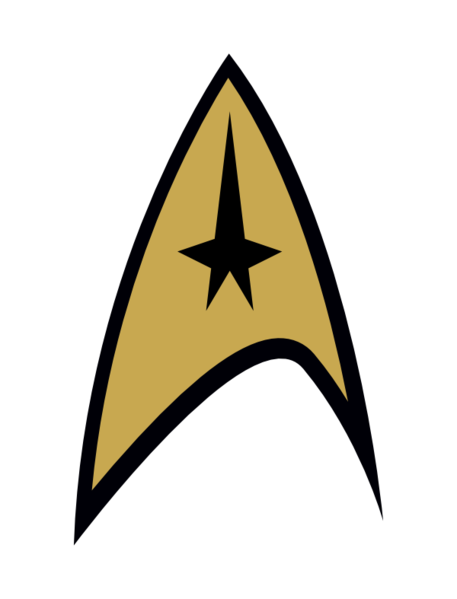

<div align="center">
  
  <h1>trekdate 🖖</h1>
  <p><strong>Convert JavaScript dates to Star Trek: The Next Generation stardates — the same system used by Captain Jean-Luc Picard.</strong></p>

  <p>
    <a href="#how-it-works">How It Works</a> •
    <a href="#install">Install</a> •
    <a href="#usage">Usage</a> •
    <a href="#api">API</a> •
    <a href="#notable-stardates">Notable Stardates</a>
  </p>

  <p>
    <a href="https://npmjs.com/package/trekdate"></a>
    
    
    
  </p>
</div>

<br />

<p align="center">
  
  <br />
  <em>Captain Jean-Luc Picard — USS Enterprise NCC-1701-D</em>
</p>

> *"Captain's log, stardate 41153.7. Our destination is planet Deneb IV…"*

## How It Works

Uses the **TNG-era stardate system** from the *Star Trek Chronology* (Okuda & Okuda):

- **Stardate 0** = January 1, 2323
- **1000 stardate units** = 1 Earth year
- **Decimal digit** = fractional day (`.0` = midnight, `.5` = noon)

This is the canonical system used across TNG, DS9, Voyager, Lower Decks, and Picard.

| Year | Stardate Range | Series |
| ---- | -------------- | ------ |
| 2364 | 41000 – 41999 | TNG Season 1 |
| 2370 | 47000 – 47999 | TNG Season 7 |
| 2375 | 52000 – 52999 | DS9 Season 7 |
| 2378 | 54000 – 54999 | VOY Final Season |
| 2401 | 78000 – 78999 | Picard Season 3 |

Current dates (21st century) produce negative stardates — that's correct! We're ~300 years before the TNG era.

## Install

```bash
npm install trekdate
# or
pnpm add trekdate
# or
yarn add trekdate
# or
bun add trekdate
```

## Usage

```js
const { toStardate, fromStardate, formatStardate, captainsLog } = require('trekdate');
```

### `toStardate(date?)`

Convert a JavaScript Date to a stardate string.

```js
toStardate(new Date('2364-01-01'));
// => "41000.0"

toStardate(new Date('2401-03-08'));
// => "78183.6"

// Current date (2026)
toStardate();
// => "-296751.2" (negative — we're before 2323!)
```

### `fromStardate(stardate)`

Convert a stardate number back to a JavaScript Date.

```js
fromStardate(41153.7);
// => 2364-02-25T...

fromStardate(47988.0);
// => 2370-12-28T...  ("All Good Things..." finale!)
```

### `formatStardate(date?)`

Get a formatted TNG-style string.

```js
formatStardate(new Date('2364-10-05'));
// => "Stardate 41756.2"
```

### `captainsLog(date?, message?)`

Generate a Captain's Log entry worthy of the Enterprise-D.

```js
captainsLog(new Date('2364-10-05'));
// => "Captain's log, stardate 41756.2."

captainsLog(
  new Date('2364-10-05'),
  'We have entered the Neutral Zone.'
);
// => "Captain's log, stardate 41756.2. We have entered the Neutral Zone."
```

## API

| Function | Parameters | Returns |
| --- | --- | --- |
| `toStardate` | `date?: Date` | `string` — e.g. `"41153.7"` |
| `fromStardate` | `stardate: number` | `Date` |
| `formatStardate` | `date?: Date` | `string` — e.g. `"Stardate 41153.7"` |
| `captainsLog` | `date?: Date, message?: string` | `string` — e.g. `"Captain's log, stardate 41153.7."` |

## Notable Stardates

```js
// TNG Pilot: "Encounter at Farpoint"
toStardate(new Date('2364-02-24')); // ~"41148.5"

// First Contact (2373)
toStardate(new Date('2373-11-22')); // ~"50893.2"

// Picard Season 3 (2401)
toStardate(new Date('2401-03-08')); // ~"78183.6"
```

## TypeScript

Full type declarations included:

```ts
import { toStardate, fromStardate, formatStardate, captainsLog } from 'trekdate';
```

## References

- [Star Trek Chronology](https://memory-alpha.fandom.com/wiki/Star_Trek_Chronology) by Mike & Denise Okuda
- [Memory Alpha: Stardate](https://memory-alpha.fandom.com/wiki/Stardate)
- [Wikipedia: Stardate](https://en.wikipedia.org/wiki/Stardate)

## License

MIT — Live long and prosper. 🖖
